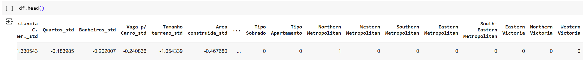
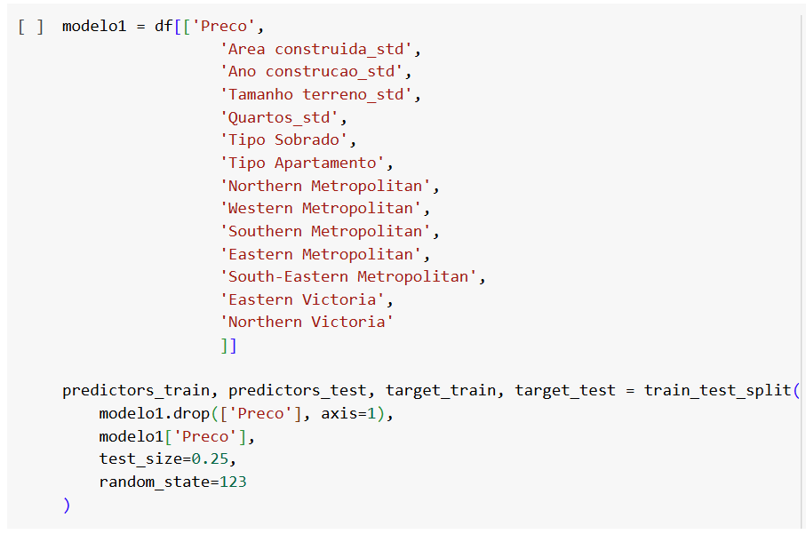
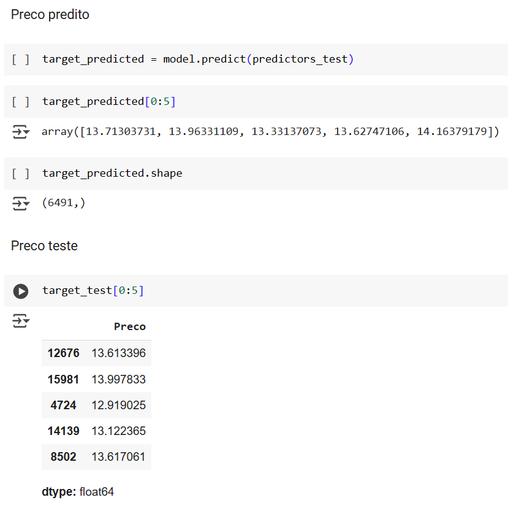
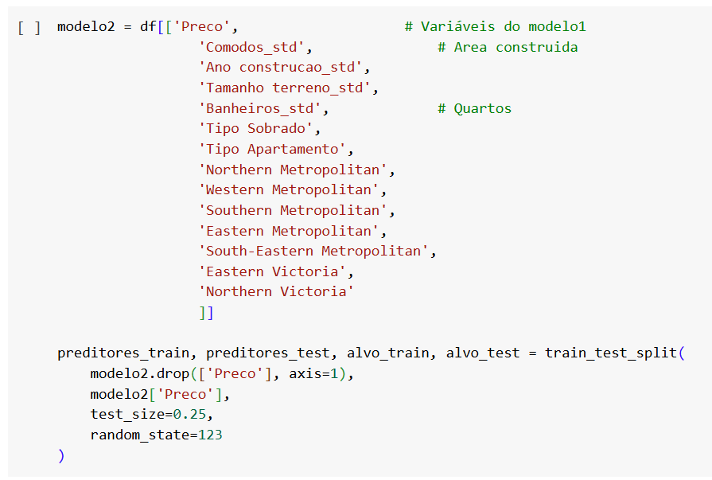
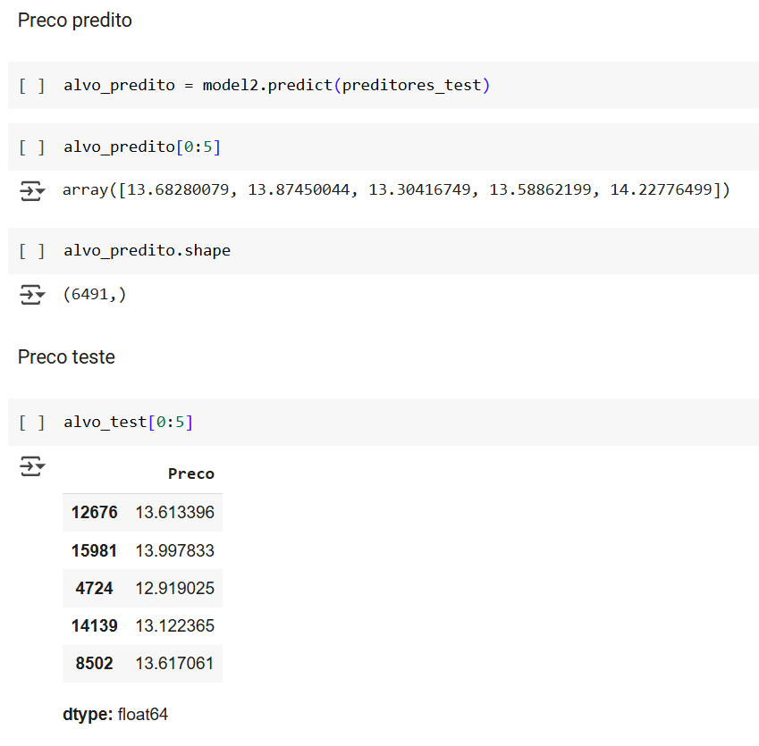
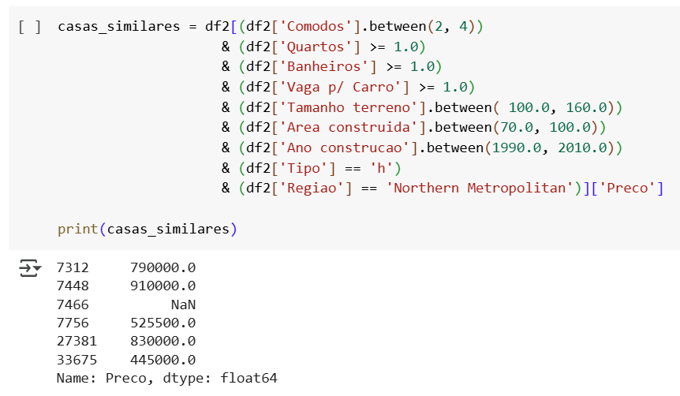

# **Mercado Imobiliário em Melbourne**

## **Predição de Preços de Imóveis utilizando Regressão Linear**
______________________________________________________________________________________________________________________________________________________________________________

**Autor:** Tiago dos Santos Arruda

**Data da Criação:** 20/01/2025
_____________________________________________________________________________________________________________________________________________________________________________

## **1. Introdução**

**Objetivo:** Prever o preço de propriedades residenciais com base em variáveis relacionadas às características físicas e geográficas dos imóveis.

**Metodologia:** Aplicação de técnicas de regressão linear para quantificar a relação entre múltiplas variáveis independentes (como área construída, localização, e tipo de propriedade) e o preço do imóvel, com o objetivo de entender a influência de cada fator no valor de mercado.
______________________________________________________________________________________________________________________________________________________________________________

## **2. Descrição da Base de Dados**

*   **Origem dos dados**: Base de dados com informações sobre preços de casas na cidade de Melbourne, Austrália.
*   **Período de coleta**: 2016 - 2018
*   **Principais Variáveis**:
    * **Preço**: Preço do imóvel (variável resposta)
    * **Area construída**: Área construída (em metros quadrados)
    * **Região**: Região onde a casa está localizada
    * **Tipo de imóvel**: Casa, Sobrado e Apartamento
______________________________________________________________________________________________________________________________________________________________________________

## **3. Fontes e Ferramentas**

A fonte dos dados utilizados na análise, do website Kaggle, está disponível [aqui](https://www.kaggle.com/datasets/anthonypino/melbourne-housing-market)

O notebook do projeto, realizado no Google Colab, está disponível [aqui](https://colab.research.google.com/drive/1h7UYnNIfKYqA4vdiY907kUGeXi17QQ-n?usp=sharing)

**3.1 Bibliotecas utilizadas no ambiente Python**

______________________________________________________________________________________________________________________________________________________________________________

## **4. Carregamento e Visualização dos Dados**

O conjunto de dados bruto consiste em 34.857 registros e 21 variáveis, representando informações detalhadas sobre as propriedades.

**4.1 Tradução para o português**

Como este projeto visa ser apresentado no Brasil, decidi por traduzir o nome das variáveis.

_____________________________________________________________________________________________________________________________________________________________________________

## **5. Limpeza dos Dados**

**5.1 Remoção de variáveis**

**5.2 Valores faltantes**

**5.3 Remoção dos valores faltantes**

**Cada variável recebeu um tratamento diverso.**

* A variável Preço(variável resposta) teve os valores faltantes removidos.
* Algumas variáveis, como: Distancia, Banheiro, Vaga Carro, tiveram os valores preenchidos com 0.
* Variáveis como Tamanho terreno e Area Construida tiveram os valores faltantes preenchidos com a mediana dos valores das casas da mesma região.

**Abaixo, a base de dados já sem os valores faltantes**

Após a remoção e tratamento dos valores faltantes, a base de dados contém 27.244 registros e 12 variáveis.

_____________________________________________________________________________________________________________________________________________________________________________

## **6. informações Estatísticas dos Dados**

* Nesta base de dados temos três tipos de moradias, sendo Casa a mais comun

* As casas estão situadas em oito regiões, sendo Southern Metropolitan a que mais aparece na base de dados

* O valor médio do preço das casas nesta base de dados é de  $1.050.210.00

* O menor preço é de $85.000.00

* O maior preço é de $11.200.000.00

* Em média, as moradias apresentam três comodos e uma vaga para carro

* **Lembrando que estes valores apresentam outliers, e precisam ser devidamente tratatos.*
_____________________________________________________________________________________________________________________________________________________________________________

## **7. Removendo Outliers**

Outliers são valores que se desviam significativamente do padrão da maioria dos dados em uma base. Eles podem distorcer análises estatísticas, como médias e desvios padrão, e afetar modelos preditivos, comprometendo a precisão das conclusões. Removê-los ajuda a obter resultados mais representativos e melhorar a qualidade da análise.

**Abaixo, o exemplo da variável Preço**

A variável "Preço" apresenta outliers nos valores mais altos, o que pode ser melhorado removendo os 1% superiores dos dados.

**Explicação:**

Embora esses valores extremos possam ser reais, como o preço de uma casa pertencente a uma celebridade, eles não representam a maioria dos imóveis da região. Tais valores fora da normalidade podem distorcer o modelo de regressão e afetar a precisão das previsões, por isso, é recomendável removê-los para obter um modelo mais robusto.

_____________________________________________________________________________________________________________________________________________________________________________

## **8. Correlações**

A matriz de correlação é extremamente útil em um projeto de regressão linear. Esta visualização ajuda a identificar relações lineares, selecionar variáveis relevantes, idendtificar multicolinearidade, explorar padrões de dados,evitar overfitting, etc.

**8.1. Interpretação da matriz de correlação**

Ao analisar a matriz de correlação percebemos os seguintes pontos:
* As variáveis mais correlacionadas a variável resposta são: Comodos, Área construida, Quartos, Banheiros, Ano de construcao.

* As variáveis que apresentam forte correlação: Comodos e Area construida ; Quartos e Banheiros.

**Estes insights são vitais para a construção dos modelos de predição
_____________________________________________________________________________________________________________________________________________________________________________

## **9. Preparação dos dados para modelagem**

**9.1 Padronização dos variáveis numéricas**

**9.2 Codificação das variáveis categóricas**

_____________________________________________________________________________________________________________________________________________________________________________

## **10. Modelos de Regressao Linear**

**Abaixo, serão desenvolvidos dois modelos de regressão linear utilizando diferentes combinações de variáveis do conjunto de dados. Em seguida, será realizada uma análise comparativa da eficiência desses modelos para avaliar seu desempenho preditivo.**

#### **10.1 Modelo1**

* Neste **modelo1**, vou usar as variáveis codificadas derivadas das categóricas
* Lembrando que para isso, devo deixar uma categoria de fora de cada conjunto de variáveis derivadas
* Esta categoria sera tratada como categoria base
* E deve ser a mesma para todos os modelos, criando consistência nas predições
* Da variável Tipo, vou deixar a **Tipo_Casa** de fora
* Da variável Regiao, vou deixar a **Western Victoria** de fora

**Avaliação do modelo1**

Abaixo, vemos que os valores preditos estão muito próximos dos valores reais da base de dados. Isso demonstra um  modelo de predição robusto. 

#### **10.2 Modelo2**

* Neste **modelo2**, vou usar as variáveis codificadas derivadas das categóricas
* Lembrando que para isso, devo deixar uma categoria de fora de cada conjunto de variáveis derivadas
* Esta categoria sera tratada como categoria base
* E deve ser a mesma para todos os modelos, criando consistência nas predições
* Da variável Tipo, vou deixar a **Tipo_Casa** de fora
* Da variável Regiao, vou deixar a **Western Victoria** de fora

**Avaliação do modelo2**

Abaixo, vemos que os valores preditos pelo modelo2 estão muito próximos aos valores reais, alguns até melhor que o modelo1. 

_____________________________________________________________________________________________________________________________________________________________________________

## **11. Comparando o RMSE dos dois modelos**

O **RMSE (Root Mean Square Error)** é uma métrica que mede a diferença média entre os valores previstos por um modelo e os valores reais, indicando a precisão das previsões. Quanto menor o RMSE, mais preciso é o modelo.

Construir dois ou mais modelos de regressão linear e compará-los é uma prática essencial na análise preditiva. Esse processo permite identificar qual modelo oferece previsões mais precisas e, consequentemente, é o mais adequado para ser utilizado em futuras previsões.

Ao comparar os modelos, métricas como o RMSE (Root Mean Square Error) são fundamentais para avaliar a precisão. Por exemplo, considerando os resultados apresentados:

**RMSE Modelo1:** 0.3355251413220781

**RMSE Modelo2:** 0.3225953587496436

Observa-se que o Modelo2 possui um RMSE mais baixo, indicando que suas previsões são, em média, mais próximas dos valores reais em comparação ao Modelo 1. Essa diferença, embora modesta, é significativa, pois demonstra uma melhoria na capacidade do Modelo 2 em prever valores com menor erro médio.

**Pelos motivos ciados, o modelo2 será utilizado para a predição a seguir**
_____________________________________________________________________________________________________________________________________________________________________________

## **12. Predição(Aplicação Prática)**

Agora é chegado o momento que justifica todo nosso trabalho até aqui. A predição do valor de uma casa, usando nosso modelo de regressao linear(modelo2).

Imagine que na imobiliária que vc trabalha um cliente entrou em contato dizendo que quer colocar a casa a venda, mas nao sabe exatamente o valor de venda. É nesse momento que nosso modelo de predição entra em ação.

O primeiro passo é colher todas as informações para preencher nosso modelo, ou seja, as características da casa.

**12.1. Vou criar aqui uma casa que os valores das características serão fictícios**

**Importante**

Embora nossa casa seja fictícia, é importante frizar que alguns valores devem ser coerentes. Por exemplo, se a casa fica na regiao Northern Metropolitan, a distância do centro comercial deve ser de 2.5. É claro que com exemplos da vida real esse detalhe nao precisa ser mencionado

* Preco .......................... é o valor que estamos buscando
* Comodos ................... 3
* Distancia C. Comer ... 2.5
* Quartos ...................... 1.0
* Banheiros ................... 1.0
* Vaga p/ Carro ............. 1.0
* Tamanho terreno ........ 132.0
* Area construida ........... 86.0
* Ano de construcao - .... 2001.0
* Qtd imoveis area ......... 4019.0
* Tipo .............................. Tipo Casa
* Regiao ...........................Northern Metropolitan
_______________________________________________________________________________________________________________________________________________________________________

## **13. Valor da casa predito**

De acordo com o modelo2, a casa com essas caracteristicas, nessa regiao, deve custar aproximadamente **$760.000**
_______________________________________________________________________________________________________________________________________________________________________
## **14. Casas Similares**

Abaixo estão listados alguns imóveis com características semelhantes ao exemplo usado na predição.

Observa-se que, apesar das similaridades nos atributos avaliados, os valores de venda apresentam variações significativas. Essa discrepância é atribuída a fatores não capturados pela base de dados, como condições específicas do imóvel (estado de conservação, qualidade dos acabamentos), particularidades do mercado local e características subjetivas que influenciam a percepção de valor.

_______________________________________________________________________________________________________________________________________________________________________

## **15. Conclusão**

Ao final deste projeto, foi possível observar a robustez do modelo de regressão linear na predição de valores de moradias. Este estudo demonstrou como algoritmos de aprendizado de máquina podem atuar como ferramentas poderosas e versáteis em diversas áreas econômicas.

**Aplicações Práticas**

O modelo desenvolvido pode ser aplicado em setores estratégicos, tais como:

* **Setor Imobiliário e Construção Civil:**

  * Determinação precisa de preços para suportar estratégias de venda ou locação.
  * Identificação de áreas com alto potencial de valorização imobiliária.
  * Otimização de portfólios de propriedades com base em tendências de mercado.

* **Bancos e Instituições Financeiras:**

  * Concessão de financiamentos ou hipotecas ancorada em valores justos de mercado.
  * Avaliação de ativos imobiliários usados como garantia.
  * Análise de riscos específicos para determinadas regiões.

* **Seguradoras:**
  * Precificação de apólices de seguros com base em localização e características do imóvel.
  * Avaliação de riscos relacionados à contratação de seguros imobiliários.

* **Governos e Políticas Públicas:**

  * Suporte ao planejamento urbano e desenvolvimento habitacional.
  * Identificação de zonas prioritárias para subsídios e políticas públicas.
  * Análise dos impactos de regulamentações no mercado imobiliário.

* **Consultoria e Investimentos:**

  * Análise e gerenciamento de portfólios de investimentos imobiliários.
  * Assessoria estratégica para fundos de investimento em propriedades.

**Considerações Técnicas**

Embora o modelo seja uma ferramenta valiosa para nortear decisões, ele apresenta limitações inerentes à dependência dos dados disponíveis. Variáveis não incluídas no conjunto de dados, como o estado de conservação do imóvel, qualidade do acabamento ou forma de pagamento, podem impactar significativamente os preços finais e precisam ser consideradas em conjunto com a previsão do modelo.

Portanto, o modelo deve ser utilizado como um complemento à expertise de profissionais do setor, como corretores e analistas. Ele oferece uma base quantitativa sólida, mas decisões finais requerem a integração de fatores qualitativos não contemplados no modelo.

**Conclusão**

Este projeto demonstrou que modelos de aprendizado de máquina, como a regressão linear, podem fornecer insights relevantes e apoiar decisões estratégicas em um contexto econômico complexo. No entanto, o uso dessas ferramentas deve ser realizado de forma responsável, com a compreensão de suas limitações e complementaridade aos esforços humanos.
_______________________________________________________________________________________________________________________________________________________________________

