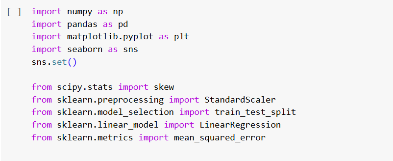
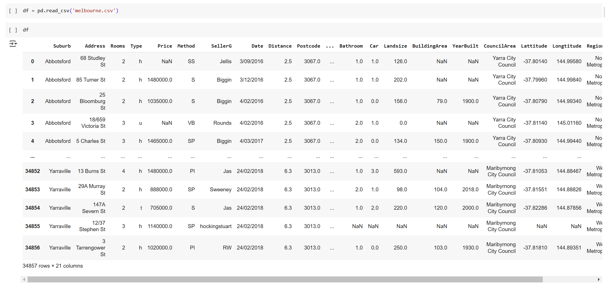

# **Mercado Imobiliário em Melbourne**

## **Predição de Preços de Imóveis utilizando Regressão Linear**
______________________________________________________________________________________________________________________________________________________________________________

**Autor:** Tiago dos Santos Arruda

**Data da Criação:** 20/01/2025
_____________________________________________________________________________________________________________________________________________________________________________

## **1. Introdução**

**Objetivo:** Prever o preço de propriedades residenciais com base em variáveis relacionadas às características físicas e geográficas dos imóveis.

**Metodologia:** Aplicação de técnicas de regressão linear para quantificar a relação entre múltiplas variáveis independentes (como área construída, localização, e tipo de propriedade) e o preço do imóvel, com o objetivo de entender a influência de cada fator no valor de mercado.
______________________________________________________________________________________________________________________________________________________________________________

## **2. Descrição da Base de Dados**

*   **Origem dos dados**: Base de dados com informações sobre preços de casas na cidade de Melbourne, Austrália.
*   **Período de coleta**: 2016 - 2018
*   **Principais Variáveis**:
    * **Preço**: Preço do imóvel (variável resposta)
    * **Area construída**: Área construída (em metros quadrados)
    * **Região**: Região onde a casa está localizada
    * **Tipo de imóvel**: Casa, Sobrado e Apartamento
______________________________________________________________________________________________________________________________________________________________________________

## **3. Fontes e Ferramentas**

A fonte dos dados utilizados na análise, do website Kaggle, está disponível [aqui](https://www.kaggle.com/datasets/anthonypino/melbourne-housing-market)

O notebook do projeto, realizado no Google Colab, está disponível [aqui](https://colab.research.google.com/drive/1h7UYnNIfKYqA4vdiY907kUGeXi17QQ-n?usp=sharing)

**3.1 Bibliotecas utilizadas no ambiente Python**

______________________________________________________________________________________________________________________________________________________________________________

## **Carregamento e Visualização dos Dados**

______________________________________________________________________________________________________________________________________________________________________________

