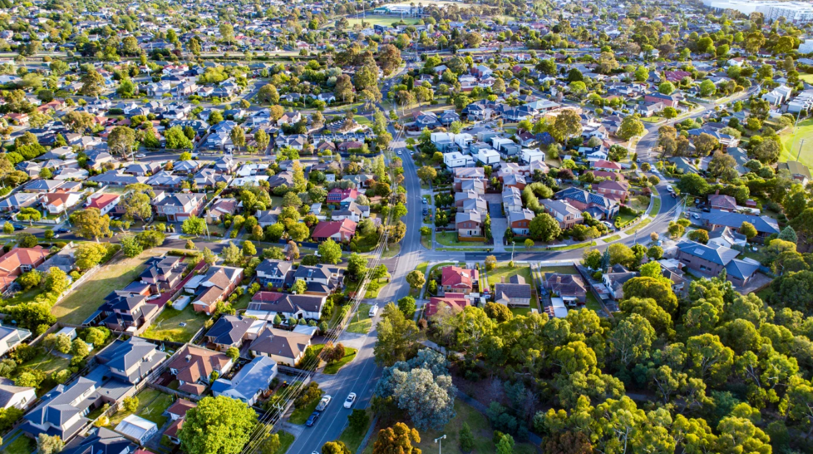
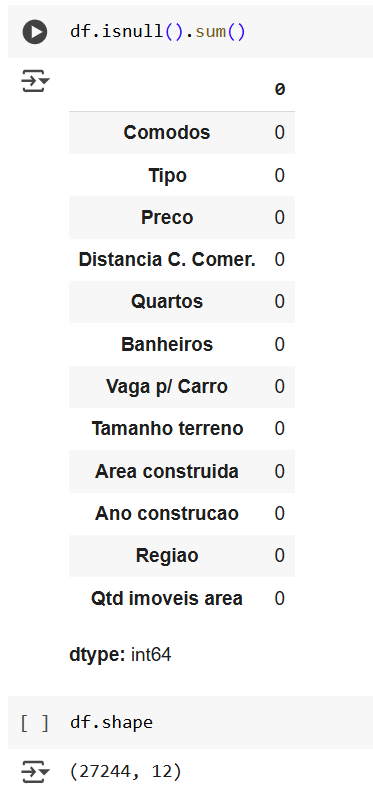

# **Mercado Imobiliário em Melbourne**

## **Predição de Preços de Imóveis utilizando Regressão Linear**
______________________________________________________________________________________________________________________________________________________________________________

**Autor:** Tiago dos Santos Arruda

**Data da Criação:** 20/01/2025
_____________________________________________________________________________________________________________________________________________________________________________

## **1. Introdução**

**Objetivo:** Prever o preço de propriedades residenciais com base em variáveis relacionadas às características físicas e geográficas dos imóveis.

**Metodologia:** Aplicação de técnicas de regressão linear para quantificar a relação entre múltiplas variáveis independentes (como área construída, localização, e tipo de propriedade) e o preço do imóvel, com o objetivo de entender a influência de cada fator no valor de mercado.
______________________________________________________________________________________________________________________________________________________________________________

## **2. Descrição da Base de Dados**

*   **Origem dos dados**: Base de dados com informações sobre preços de casas na cidade de Melbourne, Austrália.
*   **Período de coleta**: 2016 - 2018
*   **Principais Variáveis**:
    * **Preço**: Preço do imóvel (variável resposta)
    * **Area construída**: Área construída (em metros quadrados)
    * **Região**: Região onde a casa está localizada
    * **Tipo de imóvel**: Casa, Sobrado e Apartamento
______________________________________________________________________________________________________________________________________________________________________________

## **3. Fontes e Ferramentas**

A fonte dos dados utilizados na análise, do website Kaggle, está disponível [aqui](https://www.kaggle.com/datasets/anthonypino/melbourne-housing-market)

O notebook do projeto, realizado no Google Colab, está disponível [aqui](https://colab.research.google.com/drive/1h7UYnNIfKYqA4vdiY907kUGeXi17QQ-n?usp=sharing)

**3.1 Bibliotecas utilizadas no ambiente Python**

______________________________________________________________________________________________________________________________________________________________________________

## **4. Carregamento e Visualização dos Dados**

O conjunto de dados bruto consiste em 34.857 registros e 21 variáveis, representando informações detalhadas sobre as propriedades.

______________________________________________________________________________________________________________________________________________________________________________

**4.1 Tradução para o português**

Como este projeto visa ser apresentado no Brasil, decidi por traduzir o nome das variáveis.

______________________________________________________________________________________________________________________________________________________________________________

## **5. Limpeza dos Dados**

**5.1 Remoção de variáveis**

______________________________________________________________________________________________________________________________________________________________________________

**5.1 Valores faltantes**

_____________________________________________________________________________________________________________________________________________________________________________
**5.2 Remoção dos valores faltantes**

**Cada variável recebeu um tratamento diverso.**

* A variável Preço(variável resposta) teve os valores faltantes removidos.
* Algumas variáveis, como: Distancia, Banheiro, Vaga Carro, tiveram os valores preenchidos com 0.
* Variáveis como Tamanho terreno e Area Construida tiveram os valores faltantes preenchidos com a mediana dos valores das casas da mesma região.

**Abaixo, a base de dados já sem os valores faltantes**

Após a remoção e tratamento dos valores faltantes, a base de dados contém 27.244 registros e 12 variáveis.

_____________________________________________________________________________________________________________________________________________________________________________

## **6. informações Estatísticas dos Dados**

* Nesta base de dados temos três tipos de moradias, sendo Casa a mais comun

* As casas estão situadas em oito regiões, sendo Southern Metropolitan a que mais aparece na base de dados

* O valor médio do preço das casas nesta base de dados é de  $1.050.210.00

* O menor preço é de $85.000.00

* O maior preço é de $11.200.000.00

* Em média, as moradias apresentam três comodos e uma vaga para carro

* **Lembrando que estes valores apresentam outliers, e precisam ser devidamente tratatos.*
_____________________________________________________________________________________________________________________________________________________________________________

## **7. Removendo Outliers**

Outliers são valores que se desviam significativamente do padrão da maioria dos dados em uma base. Eles podem distorcer análises estatísticas, como médias e desvios padrão, e afetar modelos preditivos, comprometendo a precisão das conclusões. Removê-los ajuda a obter resultados mais representativos e melhorar a qualidade da análise.

**Abaixo, o exemplo da variável Preço**

A variável "Preço" apresenta outliers nos valores mais altos, o que pode ser melhorado removendo os 1% superiores dos dados.

**Explicação:**

Embora esses valores extremos possam ser reais, como o preço de uma casa pertencente a uma celebridade, eles não representam a maioria dos imóveis da região. Tais valores fora da normalidade podem distorcer o modelo de regressão e afetar a precisão das previsões, por isso, é recomendável removê-los para obter um modelo mais robusto.

* este processo foi aplicado em outras variaveis também
_____________________________________________________________________________________________________________________________________________________________________________

## **9. Correlações **

A matriz de correlação é extremamente útil em um projeto de regressão linear. Esta visualização ajuda a identificar relações lineares, selecionar variáveis relevantes, idendtificar multicolinearidade, explorar padrões de dados,evitar overfitting, etc.

**9.2. Interpretação da matriz de correlação**

Ao analisar a matriz de correlação percebemos os seguintes pontos:
* As variáveis mais correlacionadas a variável resposta são: Comodos, Área construida, Quartos, Banheiros, Ano de construcao.

* As variáveis que apresentam forte correlação: Comodos e Area construida ; Quartos e Banheiros.

**Estes insights são vitais para a construção dos modelos de predição
_____________________________________________________________________________________________________________________________________________________________________________

## **10 Preparação dos dados para modelagem**

**10.1 Padronização dos variáveis numéricas**

