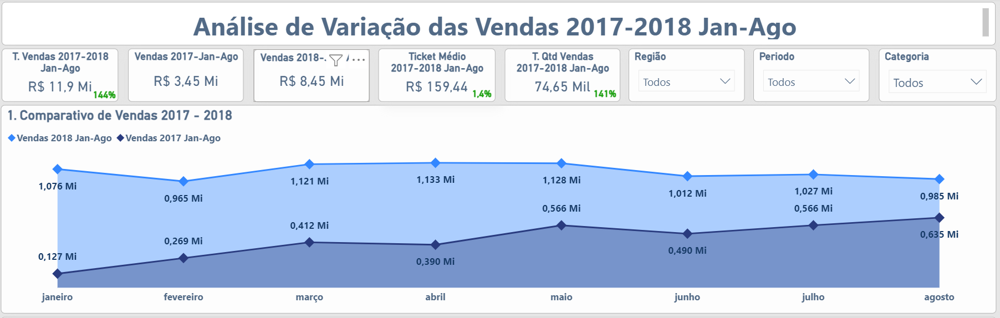
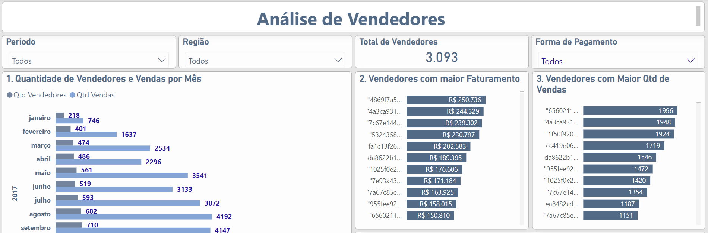

## **Análise de Vendas**

### **Sobre a empresa**
Fundado em 2015, o Olist é uma plataforma de e-commerce que conecta lojistas a grandes marketplaces, como Amazon, Mercado Livre e Magalu, permitindo que os comerciantes expandam significativamente sua visibilidade e alcancem uma base diversificada de clientes em todo o Brasil. A plataforma oferece soluções integradas que facilitam o gerenciamento de estoques, pedidos e entregas, simplificando a operação para os lojistas e otimizando a experiência do consumidor final.
O Olist possui uma rica base de dados abrangendo diversos aspectos críticos do negócio, incluindo vendas, desempenho dos vendedores, eficiência logística e níveis de satisfação do cliente. Com milhares de vendedores ativos e milhões de produtos cadastrados, a plataforma gera um volume massivo de transações diárias, o que possibilita uma análise detalhada e insights valiosos.

### **Objetivo da Análise**
Este projeto foca na análise e síntese desses dados, utilizando técnicas avançadas de análise de dados e visualização para identificar tendências, padrões e áreas de oportunidade. A análise inclui métricas-chave como crescimento de vendas, tempo de entrega e índices de satisfação (CSAT), fornecendo uma visão abrangente do desempenho operacional e comercial da empresa.

O objetivo é fornecer insights estratégicos que possam ser aplicados para otimizar processos, melhorar a eficiência logística, aumentar a satisfação do cliente e, consequentemente, impulsionar o sucesso comercial do Olist em um mercado de e-commerce cada vez mais competitivo. Além disso, esta análise busca destacar as áreas que necessitam de melhorias e desenvolver recomendações baseadas em dados para apoiar a tomada de decisão informada pelos gestores da empresa.

### **Insights e recomendações são fornecidos nos seguintes tópicos:**
**Análise de Vendas:** Avaliação de padrões históricos de vendas, tanto globalmente quanto por região, com foco em Receita, Volume de Pedidos e Valor Médio dos Pedidos.
	
**Eficiência Logística:** Avaliação da eficiência nas entregas e seu impacto na satisfação do cliente. Destacando a quantidade de entregas fora do prazo, divididas por categorias e regiões.
 
**Satisfação do Cliente:** Uma análise do feedback dos clientes, incluindo a métrica CSAT e a identificação de áreas para melhorias.

**Análise de Vendedores:** Avaliar o volume de vendas, atendimento ao cliente, quantidade ao longo do tempo, grupo com os maiores faturamentos.

### **Fontes e Ferramentas**
A fonte dos dados utilizados na análise, do website Kaggle, está disponível  [[aqui](https://www.kaggle.com/datasets/olistbr/brazilian-ecommerce)]

As consultas SQL utilizadas para limpar, organizar e preparar os dados para o dashboard estão disponíveis [[aqui](https://github.com/alexanderstramp/Portfolio/tree/main/Olist_Project/SQL_Consultas)]

O Dashboard interativo do Power BI está disponível [[aqui](https://app.powerbi.com/view?r=eyJrIjoiOTdmZTUzOTMtYTk5YS00NzU1LThlZWQtZDc0NjE0MTNjNDdlIiwidCI6ImFhOTFlMTkyLWIzYmYtNDgzYy1hM2U2LTUzN2IyZWQyNTE5YSJ9)]

### **Modelagem dos Dados**
A estrutura principal do banco de dados da empresa, conforme descrito abaixo, consiste em sete tabelas, com mais de 95.000 registros cada. A descrição do conteúdo de cada tabela é dado abaixo:

**TB_ACT_PRODUTOS:** Esta tabela armazena informações detalhadas sobre os produtos, incluindo atributos como tamanho, peso e categoria associada.

**TB_ACT_CLIENTES:** Contém dados abrangentes sobre os clientes, incluindo endereços, estados, CEPs e identificadores únicos (codigo_id).

**TB_ACT_VENDEDORES:** Armazena informações relacionadas aos vendedores, como a cidade de atuação, estado e identificadores únicos (codigo_id).

**TB_ACT_PAGAMENTOS:** Centraliza dados sobre pagamentos, abrangendo valores transacionais, métodos de pagamento e outras informações financeiras relevantes.

**TB_ACT_CATEGORIAS_E_PEDIDOS:** Trata-se de uma view criada no SQL para consolidar dados de categorias e pedidos, facilitando a extração de insights analíticos.

**TB_ACT_PEDIDOS:** Armazena todos os registros de pedidos realizados no período analisado, incluindo informações sobre data de compra, data de envio e status do pedido.

**TB_ACT_ITENS_DOS_PEDIDOS:** Detalha os itens contidos em cada pedido, com informações sobre valores de frete, vendedores associados e preços dos produtos.

**TB_ACT_AVALIAÇÕES_DOS_PEDIDOS:** Contém feedbacks dos clientes, incluindo a pontuação atribuída às compras, variando de 1 a 5 estrelas.

***Observação** A imagem acima contem sete tabelas, uma View (CATEGORIAS E PEDIDOS) e uma tabela(MEDIDAS) com as medidas DAX. 	

## **Resumo da Análise**
O ano de 2017 foi um marco significativo para o Olist. Ao analisar o desempenho de vendas, observa-se um crescimento expressivo de 562% quando se comparam o primeiro e o último mês do ano. Além disso, este período registrou o maior pico de vendas dentro do intervalo analisado, totalizando R$ 1.149.000, um mês excepcional. Esse resultado foi impulsionado por algumas categorias de produtos, destacando-se o segmento de beleza e saúde, que apresentou um crescimento de 392%, passando de R$ 14.000 em janeiro para R$ 69.000 em dezembro. É relevante mencionar que o faturamento apresentou uma disparidade regional, com a região Sudeste contribuindo com mais de 60% das vendas totais. É também na região sudeste que se concentra mais de 70% dos vendedores, algo que influencia o tempo que as entregas levam para chegar nas regiões mais distantes do mapa.

No ano de 2018, o comportamento das vendas mostrou um padrão distinto. Embora tenha alcançado, em apenas sete meses, um faturamento superior ao do ano anterior inteiro, o período não apresentou crescimento contínuo. Pelo contrário, houve uma retração de 8% quando se comparam os números do início e do final do intervalo analisado.
Em termos de eficiência logística, 2018 apresentou desafios notáveis, com aumento nos índices de pedidos entregues fora do prazo. Aqui duas regiões se destacam, a região Nordeste que registrou um aumento de 11% para 16%. E a região Norte que exibiu uma elevação ainda mais acentuada, com os números mais que dobrando, de 5% para 13%. Este cenário pode ser parcialmente atribuído ao aumento substancial no volume de vendas, o que impactou diretamente a capacidade logística da empresa.

A análise também avaliou a satisfação do cliente, utilizando a métrica CSAT (Customer Satisfaction Score). Os resultados dos dois anos revelam uma taxa de satisfação de apenas 78,9%, com avaliações positivas ficando aquém do esperado. Esse dado evidencia a necessidade de estratégias direcionadas para a conversão de clientes insatisfeitos em promotores da marca, um fator crítico para o crescimento sustentável do negócio.

### **Análise detalhada**

**Vendas**

**Página 1** do Dashboard interativo disponível [[aqui](https://app.powerbi.com/view?r=eyJrIjoiOTdmZTUzOTMtYTk5YS00NzU1LThlZWQtZDc0NjE0MTNjNDdlIiwidCI6ImFhOTFlMTkyLWIzYmYtNDgzYy1hM2U2LTUzN2IyZWQyNTE5YSJ9)]

_ No Gráfico 1, o pico de vendas ocorreu em novembro de 2017, possivelmente impulsionado pela Black Friday. A capacidade logística foi insuficiente para o aumento de volume, resultando em atrasos significativos nas entregas e impactando negativamente o CSAT, conforme evidenciado no Gráfico 5 da página Experiência do Cliente, que registrou um dos menores valores históricos.

**Eficiência Logística**

**Página 3** do Dashboard interativo disponível [[aqui](https://app.powerbi.com/view?r=eyJrIjoiOTdmZTUzOTMtYTk5YS00NzU1LThlZWQtZDc0NjE0MTNjNDdlIiwidCI6ImFhOTFlMTkyLWIzYmYtNDgzYy1hM2U2LTUzN2IyZWQyNTE5YSJ9)]

A eficiência logística em 2018 enfrentou desafios significativos, evidenciados pelo aumento nos índices de pedidos entregues fora do prazo. Na região Nordeste, o percentual de entregas atrasadas subiu de 11% para 16%, enquanto na região Norte, o índice mais que dobrou, passando de 5% para 13%. Esse cenário pode ser atribuído ao aumento substancial no volume de vendas, que impactou a capacidade logística da empresa.

**Satisfação do Cliente**

**Página 4** do Dashboard interativo disponível [[aqui](https://app.powerbi.com/view?r=eyJrIjoiOTdmZTUzOTMtYTk5YS00NzU1LThlZWQtZDc0NjE0MTNjNDdlIiwidCI6ImFhOTFlMTkyLWIzYmYtNDgzYy1hM2U2LTUzN2IyZWQyNTE5YSJ9)]

A análise da satisfação do cliente, medida pelo CSAT (Customer Satisfaction Score), revelou uma satisfação de 78,9% de avaliações positivas, um valor muito aquem do esperado. E quando comparado os valores de cada ano, o resultado ainda fica pior, de 79.5% em 2017, para 78.5% em 2018. Apesar de apresentar crescimento no volume de vendas, o nível de satisfação ficou abaixo das expectativas, sugerindo uma necessidade crítica de implementar estratégias para melhorar a experiência do cliente e converter clientes insatisfeitos em promotores da marca. Este aspecto é fundamental para o crescimento sustentável e a fidelização de clientes no longo prazo.

**Vendedores**

**Página 6** do Dashboard interativo disponível [[aqui](https://app.powerbi.com/view?r=eyJrIjoiOTdmZTUzOTMtYTk5YS00NzU1LThlZWQtZDc0NjE0MTNjNDdlIiwidCI6ImFhOTFlMTkyLWIzYmYtNDgzYy1hM2U2LTUzN2IyZWQyNTE5YSJ9)]

A distribuição de vendedores apresenta uma concentração significativa na região Sudeste, onde mais de 70% dos vendedores estão localizados. Essa concentração influencia diretamente a distribuição geográfica das vendas. 

