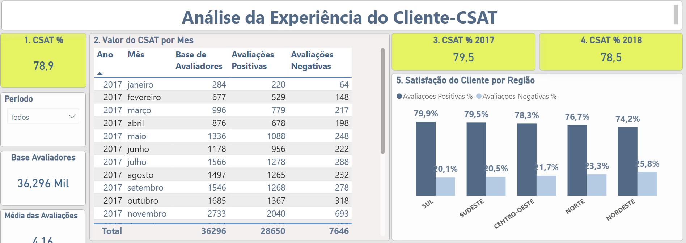

# **Análise de Vendas**

### **Sobre a empresa**
Fundado em 2015, o Olist é uma plataforma de e-commerce que conecta lojistas a grandes marketplaces, como Amazon, Mercado Livre e Magalu, permitindo que os comerciantes expandam significativamente sua visibilidade e alcancem uma base diversificada de clientes em todo o Brasil. A plataforma oferece soluções integradas que facilitam o gerenciamento de estoques, pedidos e entregas, simplificando a operação para os lojistas e otimizando a experiência do consumidor final.
O Olist possui uma rica base de dados abrangendo diversos aspectos críticos do negócio, incluindo vendas, desempenho dos vendedores, eficiência logística e níveis de satisfação do cliente. Com milhares de vendedores ativos e milhões de produtos cadastrados, a plataforma gera um volume massivo de transações diárias, o que possibilita uma análise detalhada e insights valiosos.

### **Objetivo da Análise**

O objetivo é fornecer insights estratégicos que possam ser aplicados para otimizar processos, melhorar a eficiência logística, aumentar a satisfação do cliente e, consequentemente, impulsionar o sucesso comercial do Olist em um mercado de e-commerce cada vez mais competitivo. Além disso, esta análise busca destacar as áreas que necessitam de melhorias e desenvolver recomendações baseadas em dados para apoiar a tomada de decisão informada pelos gestores da empresa.
_______________________________________________________________________________________________________________________________________________________________________

## **Insights e recomendações são fornecidos nos seguintes tópicos:**
**Análise de Vendas:** Avaliação de padrões históricos de vendas, tanto nacionalmente quanto por região, com foco em Receita, Volume de Pedidos e Valor Médio dos Pedidos.
	
**Eficiência Logística:** Avaliação da eficiência nas entregas e seu impacto na satisfação do cliente. Destacando a quantidade de entregas fora do prazo, divididas por categorias e regiões.
 
**Satisfação do Cliente:** Uma análise do feedback dos clientes, incluindo a métrica CSAT e a identificação de áreas para melhorias.

**Análise de Vendedores:** Avaliar o volume de vendas, atendimento ao cliente, quantidade ao longo do tempo, grupo com os maiores faturamentos.
_____________________________________________________________________________________________________________________________________________________________________________

## **Fontes e Ferramentas**
A fonte dos dados utilizados na análise, do website Kaggle, está disponível  [[aqui](https://www.kaggle.com/datasets/olistbr/brazilian-ecommerce)]

As consultas SQL utilizadas para limpar, organizar e preparar os dados para o dashboard estão disponíveis [[aqui](https://github.com/alexanderstramp/Portfolio/tree/main/Olist_Project/SQL_Consultas)]

O Dashboard interativo do Power BI está disponível [[aqui](https://app.powerbi.com/view?r=eyJrIjoiOTdmZTUzOTMtYTk5YS00NzU1LThlZWQtZDc0NjE0MTNjNDdlIiwidCI6ImFhOTFlMTkyLWIzYmYtNDgzYy1hM2U2LTUzN2IyZWQyNTE5YSJ9)]
_____________________________________________________________________________________________________________________________________________________________________________

## **Modelagem dos Dados**
A estrutura principal do banco de dados da empresa, conforme descrito abaixo, consiste em sete tabelas, com mais de 95.000 registros cada. A descrição do conteúdo de cada tabela é dado abaixo:

**TB_ACT_PRODUTOS:** Esta tabela armazena informações detalhadas sobre os produtos, incluindo atributos como tamanho, peso e categoria associada.

**TB_ACT_CLIENTES:** Contém dados abrangentes sobre os clientes, incluindo endereços, estados, CEPs e identificadores únicos (codigo_id).

**TB_ACT_VENDEDORES:** Armazena informações relacionadas aos vendedores, como a cidade de atuação, estado e identificadores únicos (codigo_id).

**TB_ACT_PAGAMENTOS:** Centraliza dados sobre pagamentos, abrangendo valores transacionais, métodos de pagamento e outras informações financeiras relevantes.

**TB_ACT_CATEGORIAS_E_PEDIDOS:** Trata-se de uma view criada no SQL para consolidar dados de categorias e pedidos, facilitando a extração de insights analíticos.

**TB_ACT_PEDIDOS:** Armazena todos os registros de pedidos realizados no período analisado, incluindo informações sobre data de compra, data de envio e status do pedido.

**TB_ACT_ITENS_DOS_PEDIDOS:** Detalha os itens contidos em cada pedido, com informações sobre valores de frete, vendedores associados e preços dos produtos.

**TB_ACT_AVALIAÇÕES_DOS_PEDIDOS:** Contém feedbacks dos clientes, incluindo a pontuação atribuída às compras, variando de 1 a 5 estrelas.

***Observação** A imagem acima contem sete tabelas, uma View (CATEGORIAS E PEDIDOS) e uma tabela(MEDIDAS) com as medidas DAX. 	
_____________________________________________________________________________________________________________________________________________________________________________

## **Resumo Executivo**
O ano de 2017 foi um marco significativo para o Olist. Ao analisar o desempenho de vendas, observa-se um crescimento expressivo de 562% quando se comparam o primeiro e o último mês do ano. Além disso, este período registrou o maior pico de vendas dentro do intervalo analisado, totalizando R$ 1.149.000, um mês excepcional. Esse resultado foi impulsionado por algumas categorias de produtos, destacando-se o segmento de beleza e saúde, que apresentou um crescimento de 392%, passando de R$ 14.000 em janeiro para R$ 69.000 em dezembro. É relevante mencionar que o faturamento apresentou uma disparidade regional, com a região Sudeste contribuindo com mais de 60% das vendas totais. É também na região sudeste que se concentra mais de 70% dos vendedores, algo que influencia o tempo que as entregas levam para chegar nas regiões mais distantes do mapa.

No ano de 2018, o comportamento das vendas mostrou um padrão distinto. Embora tenha alcançado, em apenas sete meses, um faturamento superior ao do ano anterior inteiro, o período não apresentou crescimento contínuo. Pelo contrário, houve uma retração de 8% quando se comparam os números do início e do final do intervalo analisado.
Em termos de eficiência logística, 2018 apresentou desafios notáveis, com aumento nos índices de pedidos entregues fora do prazo. Aqui duas regiões se destacam, a região Nordeste que registrou um aumento de 11% para 16%. E a região Norte que exibiu uma elevação ainda mais acentuada, com os números mais que dobrando, de 5% para 13%. Este cenário pode ser parcialmente atribuído ao aumento substancial no volume de vendas, o que impactou diretamente a capacidade logística da empresa.

A análise também avaliou a satisfação do cliente, utilizando a métrica CSAT (Customer Satisfaction Score). Os resultados dos dois anos revelam uma taxa de satisfação de apenas 78,9%, com avaliações positivas ficando aquém do esperado. Esse dado evidencia a necessidade de estratégias direcionadas para a conversão de clientes insatisfeitos em promotores da marca, um fator crítico para o crescimento sustentável do negócio.
_____________________________________________________________________________________________________________________________________________________________________________

## **Detalhamento da Análise:** 

**Exploração minuciosa dos pontos críticos, seguida de sugestões de ações corretivas para cada aspecto abordado.**

**Análise de Vendas**

Dashboard interativo disponível [[aqui](https://app.powerbi.com/view?r=eyJrIjoiOTdmZTUzOTMtYTk5YS00NzU1LThlZWQtZDc0NjE0MTNjNDdlIiwidCI6ImFhOTFlMTkyLWIzYmYtNDgzYy1hM2U2LTUzN2IyZWQyNTE5YSJ9)]

**Página 1 e 2**
* Conforme o Gráfico 1, o período de janeiro a agosto de 2017 evidenciou uma alta taxa de crescimento, com um aumento de 400% entre janeiro e agosto. Em contrapartida, 2018 não manteve essa tendência, apresentando uma queda de 8% nas vendas, R$1.076.000 em Janeiro, para R$ 985.000 em agosto.
* Houve um aumento marginal de 0,48% no ticket médio entre os períodos analisados (ver Card Ticket Médio da página 1). 
* O Gráfico 4 também ilustra diferenças nas preferências de compra por região. No Centro-Oeste, Nordeste e Norte, beleza_saúde é a categoria mais vendida. No Sudeste, cama_mesa_banho lidera, enquanto no Sul, esporte_lazer domina as vendas. 
_____________________________________________________________________________________________________________________________________________________________________________

**Eficiência Logística**

Dashboard interativo disponível [[aqui](https://app.powerbi.com/view?r=eyJrIjoiOTdmZTUzOTMtYTk5YS00NzU1LThlZWQtZDc0NjE0MTNjNDdlIiwidCI6ImFhOTFlMTkyLWIzYmYtNDgzYy1hM2U2LTUzN2IyZWQyNTE5YSJ9)]

**Página 3**
* O pico de vendas no período analisado ocorreu em novembro de 2017, possivelmente impulsionado pela Black Friday. No entanto, a capacidade logística pareceu insuficiente para lidar com o aumento de volume, resultando em um número significativo de entregas atrasadas nesse mesmo período. Essa situação refletiu-se negativamente no CSAT (Customer Satisfaction Score), registrando um dos menores valores históricos (ver página Experiência do Cliente - CSAT, Gráfico 5).
* A eficiência logística em 2018 enfrentou desafios significativos, o Gráfico 3 revela que, em termos absolutos, a região Sudeste registra o maior número de entregas atrasadas. No entanto, proporcionalmente, apenas 7% das entregas na região Sudeste são feitas fora do prazo, em contraste com 14% na região Nordeste e 9% na região Norte. Isso pode ser atribuído à complexidade logística em regiões mais distantes, onde múltiplas transportadoras estão envolvidas, aumentando o tempo de trânsito dos produtos.
* O CARD Valor Médio do Frete em vermelho indica um aumento no custo de frete entre os dois anos, possivelmente influenciado por fatores externos como aumento nos preços de pedágio e óleo diesel.
_____________________________________________________________________________________________________________________________________________________________________________

**Satisfação do Cliente**

 Dashboard interativo disponível [[aqui](https://app.powerbi.com/view?r=eyJrIjoiOTdmZTUzOTMtYTk5YS00NzU1LThlZWQtZDc0NjE0MTNjNDdlIiwidCI6ImFhOTFlMTkyLWIzYmYtNDgzYy1hM2U2LTUzN2IyZWQyNTE5YSJ9)]

**Página 4**
* O CSAT é uma métrica que quantifica a satisfação do cliente com base na proporção de avaliações positivas em relação ao total de avaliações recebidas. Avaliações de 4 e 5 estrelas são consideradas positivas, enquanto 1, 2 e 3 estrelas são consideradas negativas.
* O CARD 1 CSAT % revela um valor de satisfação abaixo de 80%, indicado pelo fundo amarelo. Quando o CSAT atinge ou supera 80%, o fundo do card muda para verde, refletindo uma meta de satisfação atingida. A satisfação do cliente é crítica para a sustentabilidade e sucesso do negócio.
* Conforme o Gráfico 5, a região Sul lidera em satisfação com 79,9%, enquanto o Nordeste apresenta o menor índice de satisfação, com 74,2%. Em e-commerce, a satisfação está fortemente correlacionada à eficiência no processo de entrega.
_____________________________________________________________________________________________________________________________________________________________________________

**Análise de Vendedores**

Dashboard interativo disponível [[aqui](https://app.powerbi.com/view?r=eyJrIjoiOTdmZTUzOTMtYTk5YS00NzU1LThlZWQtZDc0NjE0MTNjNDdlIiwidCI6ImFhOTFlMTkyLWIzYmYtNDgzYy1hM2U2LTUzN2IyZWQyNTE5YSJ9)]

**Página 6**
* O Gráfico 1 apresenta uma análise temporal da correlação entre o número de vendedores ativos e o volume de vendas gerado. A correlação positiva observada sugere que a expansão da base de vendedores contribui diretamente para o crescimento das vendas totais.
* Os Gráficos 2 e 3 mostram a distribuição de faturamento por vendedor, indicando uma concentração significativa de vendedores com baixo desempenho.
* O CARD Forma de Pagamento expõe a variabilidade nas opções de pagamento oferecidas pelos vendedores. A análise dos dados sugere que a baixa diversificação nas formas de pagamento pode estar correlacionada com a perda de vendas. 
_____________________________________________________________________________________________________________________________________________________________________________

## **Recomendações**
Planos de ações especificos para cada aspecto crítico destacado pela análise. 

### **Análise de Vendas:**

**Com relação a taxa de crescimento baixa no ano de 2018:**

* Realizar análises detalhadas de períodos de baixo crescimento para identificar padrões e fatores de impacto que possam influenciar a demanda. Paralelamente, aplicar modelos de previsão para estimar a demanda futura, utilizando dados históricos e variáveis externas. Esta abordagem integrada permitirá antecipar flutuações de mercado, otimizar o planejamento de estoque e melhorar a eficiência operacional, evitando tanto excessos quanto faltas de produtos.

**Com relação ao crescimento ínfimo do ticket médio:**

* Implementar estratégias de vendas cruzadas e bundles, combinando produtos complementares e criando promoções com foco na maximização do ticket médio. Utilizar análise de dados de comportamento de compra para personalizar as ofertas e otimizar os resultados.

**Com relação as diferenças pelas preferencias de compras por região:**

* Desenvolver campanhas de marketing segmentadas por região, com base em análises de dados históricos de vendas e preferências locais, além de direcionar esforços para regiões com menor participação de vendas. Ao mesmo tempo criar programas de fidelização que oferecam beneficios exclusivos
_____________________________________________________________________________________________________________________________________________________________________________

### **Eficiência Logística:**

**Com relacao as sobrecargas de entregas em períodos sazonais, e os atrasos que algumas regioes do país sofrem:**

* Implementar uma estratégia de expansão logística focada em períodos de alta demanda, mediante a análise de dados históricos de volume de pedidos e sazonalidade. Para mitigar riscos de atraso e melhorar a eficiência nas entregas, recomenda-se o estabelecimento de parcerias estratégicas com transportadoras e empresas de ônibus que oferecem serviços de transporte de mercadorias. A seleção dessas parcerias será baseada em uma análise detalhada de custo-benefício e desempenho, considerando métricas como tempo de entrega, taxa de sucesso nas entregas e cobertura regional. A utilização de transportadoras locais, com expertise nas áreas de destino, poderá melhorar a agilidade e precisão das entregas, contribuindo para uma experiência de cliente superior.
* Analisar e otimizar o lead time entre a confirmação de compra e o despacho do pedido pelo vendedor. O objetivo é identificar gargalos e implementar melhorias que aumentem a eficiência operacional e reduzam o tempo de entrega ao cliente. Esta análise envolverá o uso de métricas de desempenho, análise de dados históricos e modelagem preditiva para recomendar ações que possam acelerar o processo de fulfillment.
_____________________________________________________________________________________________________________________________________________________________________________

### **Satisfação do Cliente:**

**Com relação ao baixo valor do CSAT**

* Implementar um sistema de comunicação eficiente para informar os clientes sobre prazos de entrega e possíveis atrasos, especialmente durante períodos críticos. Analisar dados de performance de entrega e ajustar as mensagens de forma que aumentem a confiança do cliente e reduzam as reclamações.
* Estabelecer um programa contínuo de coleta de feedback, utilizando ferramentas de análise de sentimentos para capturar e resolver problemas reportados por clientes insatisfeitos. Analisar os dados de feedback para identificar áreas de melhoria e transformar clientes insatisfeitos em promotores da marca.

**Com relação a regiões que apresentam valores de CSAT mais baixos que outras:**

* Conduzir análises detalhadas de CSAT (Customer Satisfaction Score) em regiões com baixo desempenho, identificando as causas subjacentes das insatisfações. Estabelecer metas específicas para CSAT e monitorar o desempenho de forma contínua, ajustando estratégias conforme necessário para melhorar a experiência do cliente.
_____________________________________________________________________________________________________________________________________________________________________________

### **Análise de Vendedores:**

**Com relação a base de vendedores estar relacionada a quantidade de vendas:**

* Estabelecer políticas para aquisição e retenção de vendedores, com foco especial em regiões com baixa representatividade, utilizando dados de desempenho e análise geográfica para otimizar a distribuição de recursos.

**Com relação ao baixo desempenho de alguns vendedores:**
* Implementar estratégias de vendas cruzadas e bundles, combinando produtos complementares e criando promoções com foco na maximização do ticket médio. Utilizar análise de dados de comportamento de compra para personalizar as ofertas e otimizar os resultados.

**Com relação as poucas ofertas na forma de pagamento:**
  * Recomenda-se instruir os vendedores a diversificarem as formas de pagamento oferecidas, destacando a correlação positiva entre a disponibilidade de opções de pagamento e o aumento nas vendas. Quando necessário, fornecer suporte no processo de implementação dessas opções para assegurar a adesão e eficácia da estratégia.
_____________________________________________________________________________________________________________________________________________________________________________

