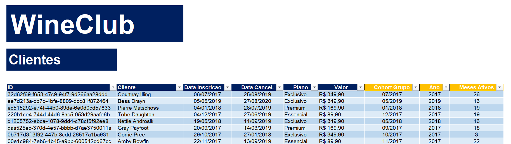
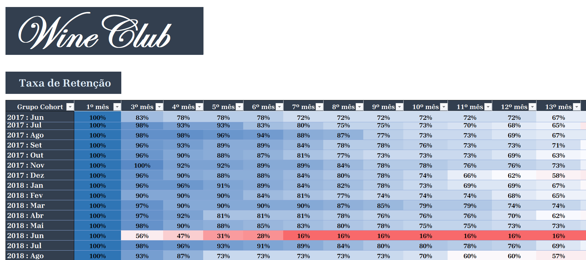
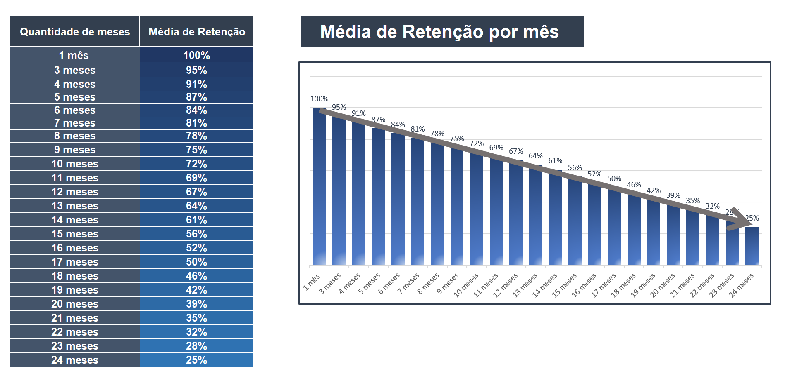

# **Análise da Taxa de Retenção de Clientes**
_____________________________________________________________________________________________________________________________________________________________________________
**Autor:** Tiago dos Santos Arruda

**Data da Criação:** 07/02/2025
_____________________________________________________________________________________________________________________________________________________________________________
## **1. Sobre a empresa**

WineClub é uma plataforma especializada na comercialização de vinhos online, oferecendo uma experiência premium para apreciadores da bebida. Por meio de diferentes modalidades de assinatura, os clientes recebem mensalmente uma seleção exclusiva de rótulos premiados, importados e raros, acompanhados de itens complementares que enriquecem a experiência de degustação. Além disso, a empresa proporciona acesso a eventos exclusivos do setor, fortalecendo o vínculo entre os assinantes e o universo dos vinhos.
___________________________________________________________________________________________________________________________________________________________________________
## **2. Análise de Cohort**

Para este estudo, foi adotada a análise de cohort para avaliar a taxa de retenção de clientes ao longo do tempo. A análise de cohort consiste em segmentar os clientes com base no período de sua primeira compra, permitindo identificar padrões de comportamento e lealdade. A retenção será calculada mensalmente, medindo a permanência dos clientes ativos em relação ao grupo inicial. Essa abordagem fornecerá insights estratégicos sobre engajamento, recorrência de compras e oportunidades de melhoria no modelo de aquisição e fidelização.
___________________________________________________________________________________________________________________________________________________________________________
## **3. Objetivo**

O objetivo desta análise é identificar tendências no comportamento dos clientes, avaliar a retenção ao longo do tempo e gerar insights para otimizar estratégias de marketing e vendas. Além disso, busca-se observar o impacto das promoções mensais elaboradas pela empresa, analisando seu sucesso ao longo do tempo e sua influência na fidelização e recorrência de compras.
___________________________________________________________________________________________________________________________________________________________________________
## **4. Fontes e Ferramentas**

**4.1** Todo o projeto, incluido limpeza, exploração, tabelas dinâmicas e visualizações, foi realizado no Excel.

**4.2** A fonte, para visualizaçãodos dos dados, está disponível [aqui](https://1drv.ms/x/c/68363fd9bda23a4c/EZNmTfsCRzBKlg1qyV7DJH8BFlD_7d8h1j97nqxUXAfnjg?e=QbA0u5)
___________________________________________________________________________________________________________________________________________________________________________
## **5. Conjunto de Dados**

A base de dados contém registros de 1.000 clientes. Para a análise, foram selecionadas as assinaturas com datas de inscrição entre junho de 2017 e julho de 2019. O acompanhamento foi realizado por um período de 24 meses para avaliar a retenção e o comportamento dos clientes ao longo do tempo.

A fonte, para visualizaçãodos dos dados, está disponível [aqui](https://1drv.ms/x/c/68363fd9bda23a4c/EZNmTfsCRzBKlg1qyV7DJH8BFlD_7d8h1j97nqxUXAfnjg?e=QbA0u5)

**5.1 Os dados contêm informações sobre:**

**ID do Cliente:** identificador único do cliente na base de dados.

**Nome do Cliente:** nome do assinante do serviço.

**Data da Inscrição:** data em que o cliente iniciou a assinatura.

**Data do Cancelamento:** data em que o cliente cancelou a assinatura (se aplicável).

**Plano:** nome do plano de assinatura escolhido pelo cliente.

**Valor:** preço do plano contratado.

**5.2 As duas últimas colunas da base foram geradas para a análise de cohort**

**Grupo Cohort:** refere-se ao mês e ano da inscrição, permitindo agrupar os clientes com base no período de adesão.

**Meses Ativos:** indica a quantidade de meses durante os quais o cliente manteve a assinatura ativa, sendo uma métrica crucial para calcular a retenção ao longo do tempo.
___________________________________________________________________________________________________________________________________________________________________________
## **6. Metodologia**

**6.1 Definição dos Cohorts:** Os clientes foram agrupados com base na data da primeira compra para análise de retenção. Além disso, foi criada uma coluna que calcula o tempo de permanência de cada cliente, expressa em meses desde a primeira compra até o último período analisado.

**6.2 Cálculo da Retenção:** Cálculo da Retenção: A retenção foi calculada como o percentual de clientes de cada cohort que realizaram novas compras em períodos subsequentes. Para isso, foi analisado o comportamento de recompra ao longo do tempo, comparando o número de clientes ativos em cada mês com o total inicial do cohort. Esse cálculo permite identificar padrões de fidelização e a eficácia de estratégias de retenção.

**6.3 Análise Gráfica:** Foram criadas tabelas de cohort e visualizações para acompanhar a retenção dos clientes ao longo do tempo. A matriz de cohort mostra a taxa de permanência de cada grupo em diferentes períodos, enquanto gráficos de linha facilitam a identificação de padrões. Essas análises ajudam a avaliar a eficácia das estratégias de retenção e a identificar períodos críticos de queda no engajamento.

**6.4 Insights e Recomendações:** A análise dos cohort permitiu identificar padrões de retenção e momentos críticos de churn. Com base nos dados, foram feitas recomendações estratégicas, como otimização de campanhas de reengajamento, incentivos para clientes em risco de abandono e aprimoramento da experiência pós-compra. Essas sugestões visam aumentar a fidelização e maximizar o valor do ciclo de vida do cliente.
___________________________________________________________________________________________________________________________________________________________________________
## **7. Visualização dos Dados**

**7.1 Tabela de Cohort:** Representação matricial da retenção de clientes por período.

A fonte, para visualização completa da tabela, está disponível [aqui](https://1drv.ms/x/c/68363fd9bda23a4c/EZNmTfsCRzBKlg1qyV7DJH8BFlD_7d8h1j97nqxUXAfnjg?e=QbA0u5)

**7.2 Gráfico de Retenção:** Exibe a taxa de retenção por cohort ao longo do tempo.

A fonte, para visualização completa da tabela, está disponível [aqui](https://1drv.ms/x/c/68363fd9bda23a4c/EZNmTfsCRzBKlg1qyV7DJH8BFlD_7d8h1j97nqxUXAfnjg?e=QbA0u5)
_________________________________________________________________________________________________________________________________________________________________________
## **8. Resumo Executivo**

## Principais Descobertas
- [ ] **Quais cohorts têm melhor retenção?**
- [ ] **Há algum padrão sazonal na retenção?**
- [ ] **Quais estratégias podem ser implementadas para melhorar a retenção?**

## Conclusão e Ações
Com base na análise, podemos propor estratégias como:
- Personalização de ofertas para cohorts com baixa retenção.
- Investimento em campanhas de reengajamento.
- Melhor segmentação de marketing baseada no comportamento dos clientes.
- 
