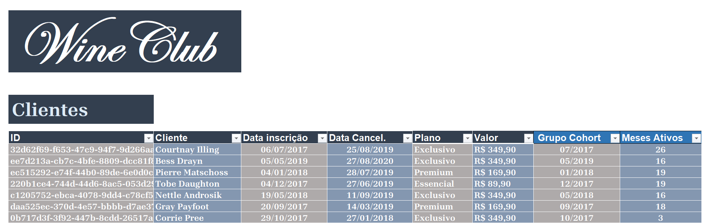
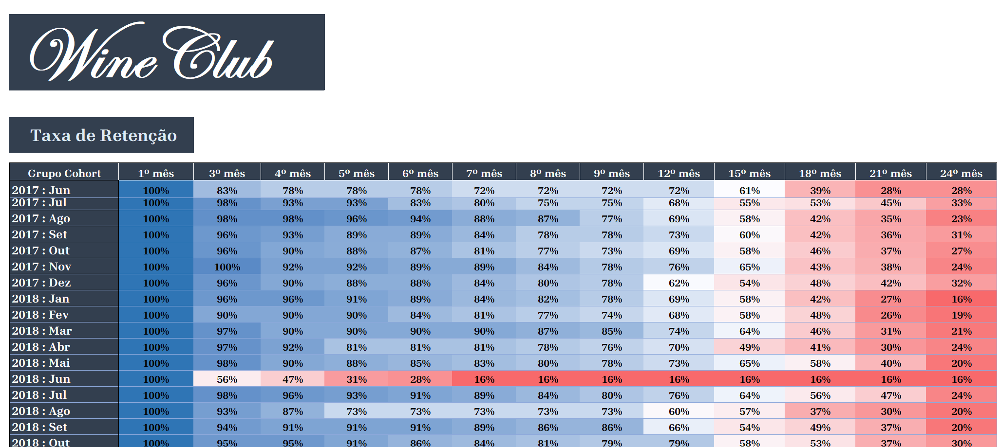
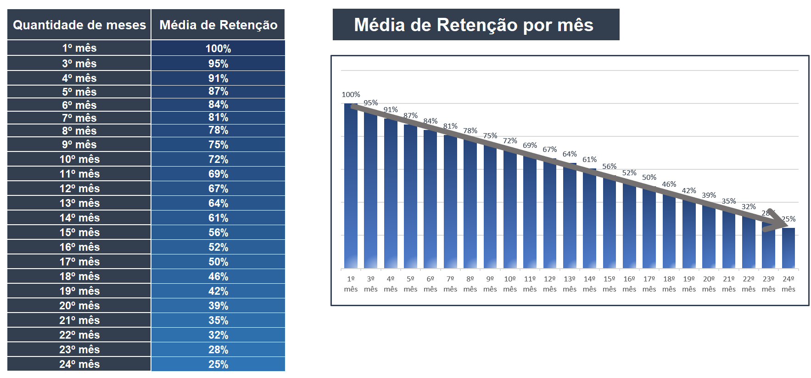
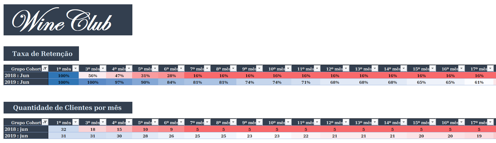

# **Análise da Taxa de Retenção de Clientes**
_____________________________________________________________________________________________________________________________________________________________________________
**Autor:** Tiago dos Santos Arruda

**Data da Criação:** 14/02/2025
_____________________________________________________________________________________________________________________________________________________________________________
## **1. Sobre a empresa**

WineClub é uma plataforma especializada na comercialização de vinhos online, oferecendo uma experiência premium para apreciadores da bebida. Por meio de diferentes modalidades de assinatura, os clientes recebem mensalmente uma seleção exclusiva de rótulos premiados, importados e raros, acompanhados de itens complementares que enriquecem a experiência de degustação. Além disso, a empresa proporciona acesso a eventos exclusivos do setor, fortalecendo o vínculo entre os assinantes e o universo dos vinhos.
___________________________________________________________________________________________________________________________________________________________________________
## **2. Análise de Cohort**

Para este estudo, foi adotada a análise de cohort para avaliar a taxa de retenção de clientes ao longo do tempo. A análise de cohort consiste em segmentar os clientes com base no período de sua primeira compra, permitindo identificar padrões de comportamento e lealdade. A retenção será calculada mensalmente, medindo a permanência dos clientes ativos em relação ao grupo inicial. Essa abordagem fornecerá insights estratégicos sobre engajamento, recorrência de compras e oportunidades de melhoria no modelo de aquisição e fidelização.
___________________________________________________________________________________________________________________________________________________________________________
## **3. Objetivo**

O objetivo desta análise é identificar tendências no comportamento dos clientes, avaliar a retenção ao longo do tempo e gerar insights para otimizar estratégias de marketing e vendas. Além disso, busca-se observar o impacto das promoções mensais elaboradas pela empresa, analisando seu sucesso ao longo do tempo e sua influência na fidelização e recorrência de compras.
___________________________________________________________________________________________________________________________________________________________________________
## **4. Fontes e Ferramentas**

**4.1** Todo o projeto, incluido limpeza, exploração, tabelas dinâmicas e visualizações, foi realizado no Excel.

**4.2** A fonte, para visualizaçãodos dos dados, está disponível [aqui](https://1drv.ms/x/c/68363fd9bda23a4c/EZNmTfsCRzBKlg1qyV7DJH8BFlD_7d8h1j97nqxUXAfnjg?e=QbA0u5)
___________________________________________________________________________________________________________________________________________________________________________
## **5. Base de Dados**

A base de dados contém registros de 1.000 clientes. Para a análise foram selecionadas as assinaturas com datas de inscrição entre junho de 2017 e julho de 2019. O acompanhamento foi realizado por um período de 24 meses para avaliar a retenção e o comportamento dos clientes ao longo do tempo.

A fonte, para visualizaçãodos dos dados, está disponível [aqui](https://1drv.ms/x/c/68363fd9bda23a4c/EZNmTfsCRzBKlg1qyV7DJH8BFlD_7d8h1j97nqxUXAfnjg?e=QbA0u5)

**5.1 Os dados contêm informações sobre:**

**ID do Cliente:** identificador único do cliente na base de dados.

**Nome do Cliente:** nome do assinante do serviço.

**Data da Inscrição:** data em que o cliente iniciou a assinatura.

**Data do Cancelamento:** data em que o cliente cancelou a assinatura (se aplicável).

**Plano:** nome do plano de assinatura escolhido pelo cliente.

**Valor:** preço do plano contratado.

**5.2 As duas últimas colunas da base foram geradas para a análise de cohort**

**Grupo Cohort:** refere-se ao mês e ano da inscrição, permitindo agrupar os clientes com base no período de adesão.

**Meses Ativos:** indica a quantidade de meses durante os quais o cliente manteve a assinatura ativa, sendo uma métrica crucial para calcular a retenção ao longo do tempo.
___________________________________________________________________________________________________________________________________________________________________________
## **6. Metodologia**

**6.1 Definição dos Cohorts:** Os clientes foram agrupados com base na data da primeira compra para análise de retenção. Além disso, foi criada uma coluna que calcula o tempo de permanência de cada cliente, expressa em meses desde a primeira compra até o último período analisado.

**6.2 Cálculo da Retenção:** A retenção foi calculada com o percentual de clientes de cada cohort que mantinham a assinatura ativada. Para isso, foi analisado o comportamento de recompra ao longo do tempo, comparando o número de clientes ativos em cada mês com o total inicial do cohort. Esse cálculo permite identificar padrões de fidelização e a eficácia de estratégias de retenção.

**6.3 Análise Gráfica:** Foram criadas tabelas de cohort e visualizações para acompanhar a retenção dos clientes ao longo do tempo. A matriz de cohort mostra a taxa de permanência de cada grupo em diferentes períodos, enquanto gráficos facilitam a identificação de padrões. Essas análises ajudam a avaliar a eficácia das estratégias de retenção e a identificar períodos críticos de queda no engajamento.

**6.4 Insights e Recomendações:** A análise dos cohort permitiu identificar padrões de retenção e momentos críticos de churn. Com base nos dados, foram feitas recomendações estratégicas. Essas sugestões visam aumentar a fidelização e maximizar o valor do ciclo de vida do cliente.
___________________________________________________________________________________________________________________________________________________________________________
## **7. Visualização dos Dados**

**7.1 Tabela de Cohort:** Representação matricial da retenção de clientes por período.

**Obs:** algumas colunas foram ocultadas para uma melhor visualização da tabela. Na ferramenta excel basta desagrupar a tabela. 

A fonte, para visualização completa da tabela, está disponível [aqui](https://1drv.ms/x/c/68363fd9bda23a4c/EZNmTfsCRzBKlg1qyV7DJH8BFlD_7d8h1j97nqxUXAfnjg?e=QbA0u5)

**7.2 Gráfico de Retenção:** Exibe a média da taxa de retenção por cohort ao longo do tempo.

A fonte, para visualização completa da tabela, está disponível [aqui](https://1drv.ms/x/c/68363fd9bda23a4c/EZNmTfsCRzBKlg1qyV7DJH8BFlD_7d8h1j97nqxUXAfnjg?e=QbA0u5)

**7.3 Comparando diferentes períodos:** No exemplo abaixo, esta sendo comparado o pior e o melhor mês da base analisada.

A fonte, para visualização completa da tabela, está disponível [aqui](https://1drv.ms/x/c/68363fd9bda23a4c/EZNmTfsCRzBKlg1qyV7DJH8BFlD_7d8h1j97nqxUXAfnjg?e=QbA0u5)
_________________________________________________________________________________________________________________________________________________________________________
## **8. Resumo Executivo**

A análise de retenção de clientes revela padrões e pontos críticos para a plataforma de assinatura de vinhos.

Inicialmente, a retenção é alta, com 95% dos clientes mantendo a adesão até o terceiro mês. No entanto, a partir do sexto mês, a retenção começa a cair, atingindo 67% no 12º mês. Essa redução pode ser causada pela saturação do serviço e mudanças nas necessidades dos clientes. Entre os meses 12º e 18º, a queda na retenção é mais acentuada, indo de 67% para 46%. Isso sugere desgaste da oferta inicial e falta de incentivos contínuos. No 24º mês, a taxa média de retenção é de 25%, indicando uma fidelização mais frágil ao longo do tempo. Em contraste, junho de 2019 apresentou a melhor taxa de retenção, com 35% dos clientes ainda ativos no 24º mês, indicando o sucesso de estratégias de fidelização. O período de junho de 2018 teve a pior performance, com queda acentuada da retenção para 56% no 3º mês e 16% no 7º mês, o que pode refletir mudanças no preço, qualidade do serviço ou marketing. Comparando 2017 com 2019, observa-se que os clientes de 2017 mostraram uma retenção mais estável. Isso pode indicar mudanças na empresa ou no perfil dos consumidores. Os meses de dezembro de 2018, janeiro e fevereiro de 2019 apresentaram boa fidelização ao longo de 14 meses, embora fevereiro de 2019 tenha registrado um desempenho abaixo da média na aquisição de novos clientes, sugerindo ajustes necessários nas estratégias de marketing.

Vale ressaltar que, além de fatores internos como mudanças na oferta ou estratégias de marketing, fatores externos também devem ser considerados. A situação econômica, a entrada de novos concorrentes, mudanças no comportamento do consumidor ou alterações na legislação e regulamentação podem impactar diretamente o comportamento de retenção dos clientes. Uma análise de variáveis externas ajuda a entender melhor as flutuações na fidelidade dos clientes e a adaptar as estratégias de forma eficaz.
_________________________________________________________________________________________________________________________________________________________________________
## **9. Detalhamento da Análise:** 

**Abaixo, uma exploração minuciosa dos pontos observados, seguida de recomendações de plano de ações para cada aspecto abordado.**

**1.** As condições oferecidas para novos clientes aparentemente são encerradas no terceiro mês, período em que observamos uma leve taxa de churn(desistências). No entanto, a retenção média ainda se mantém elevada, em torno de 95%, indicando uma boa aderência inicial ao produto/serviço. A partir desse período, muito comun em uma análise de cohort, temos uma queda na taxa de retenção. Isso fica claro na aba "Média de Retenção por mês" no arquivo excel. 

**1.1 Recomendação:** Recomenda-se uma análise aprofundada das condições oferecidas nos três primeiros meses, utilizando testes A/B para avaliar o impacto da extensão dessas vantagens na retenção de clientes a longo prazo. Além disso, a segmentação dos usuários por comportamento de consumo e perfil demográfico pode fornecer insights sobre quais grupos se beneficiam mais dessas condições. A modelagem preditiva também pode ser utilizada para estimar a probabilidade de churn caso os benefícios sejam reduzidos ou estendidos, permitindo uma tomada de decisão baseada em dados.

**2.** A partir do sexto mês, a retenção começa a diminuir de forma mais acentuada. O maior declínio ocorre entre o 12º e o 18º mês, quando a taxa de retenção reduz de 67% para 46%, representando uma queda de 21 pontos percentuais, o que equivale a uma redução de 31% em relação ao início do período citado. 

**2.1 Recomendação:** Para mitigar a queda na retenção observada entre o 12º e o 18º mês, recomenda-se uma análise aprofundada do valor percebido pelos clientes ao longo do tempo. Isso pode ser feito por meio de pesquisas de satisfação e análise de sentimentos em interações com a plataforma, além do monitoramento contínuo do Net Promoter Score (NPS) para identificar pontos de insatisfação. Estratégias de reativação também são relevantes, como incentivos para renovação, descontos progressivos e benefícios exclusivos para assinantes de longo prazo, também podem contribuir para a retenção. Por fim, recomenda-se a realização de testes A/B para avaliar a eficácia de diferentes abordagens e ajustar continuamente as estratégias com base nos dados coletados.

**3.** No 24º mês, o último período avaliado, a média de clientes iniciais ainda ativos é de 25%. Essa queda na retenção ao longo do tempo pode indicar que os clientes adquiridos no início do período apresentaram um comportamento de fidelização mais frágil. 

**3.1 Recomendação:** Uma retenção média de clientes de 25%, é considerado um valor baixo quando comparado a outros setores, onde a retenção pode chegar a 55% ou mais. Para melhorar esse índice, recomenda-se investir em estratégias de fidelização, como programas de recompensa, ofertas personalizadas e comunicação contínua. Além disso, aprimorar a experiência do cliente e coletar feedbacks para ajustes contínuos pode aumentar o engajamento e reduzir a taxa de churn.

**4.** O período de junho de 2018 apresenta a pior performance na tabela, com uma queda acentuada na taxa de retenção. No terceiro mês, a retenção diminui para 56%, e no sétimo mês atinge 16%, valor que se mantém até o último mês

**4.1 Recomendação:** Recomenda-se uma análise detalhada dos fatores que podem ter influenciado essa queda, como mudanças nos preços, na qualidade do serviço ou na estratégia de marketing. Isso pode ser feito por meio da correlação entre esses eventos e a retenção de clientes, além da análise de feedbacks e reclamações do período. Caso sejam identificadas mudanças negativas, estratégias de recuperação devem ser implementadas, como reajuste de preços, melhoria no atendimento e ofertas segmentadas para reconquistar clientes inativos.

**Abaixo, fatores de sucesso identificados que devem ser analisados e modelados para replicação em outros períodos**

**5.** O mês de junho de 2019 apresenta a melhor taxa de retenção do período analisado, mantendo uma trajetória consistente ao longo do tempo. No vigésimo quarto mês, 35% dos clientes ainda permanecem ativos. Esse desempenho deixa claro que um plano de ação foi posto em prática e bem executado, evitando assim o que aconteceu em junho de 2017 e 2018. Este plano de ação foi eficazes na fidelização e engajamento, que contribuíram para a manutenção de uma base de clientes sólida ao longo do período.

**6.** Os cohorts de dezembro de 2018, janeiro e fevereiro de 2019 apresentaram uma taxa de retenção elevada ao longo de 14 meses, destacando-se entre os períodos analisados. Recomenda-se uma análise aprofundada, envolvendo todas as áreas estratégicas, para correlacionar os indicadores de negócio e identificar os fatores que contribuíram para esse desempenho. O uso de modelagem estatística e análise preditiva pode auxiliar na replicação desses padrões em cohorts futuros.
_________________________________________________________________________________________________________________________________________________________________________
